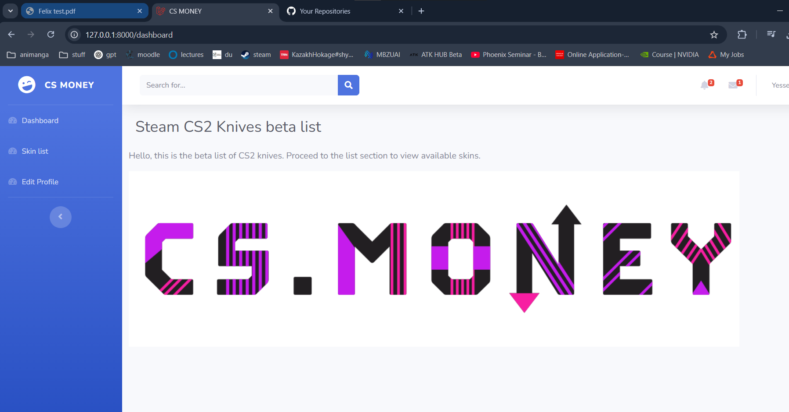
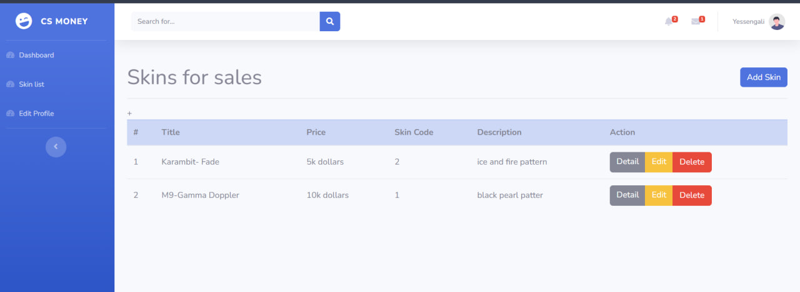
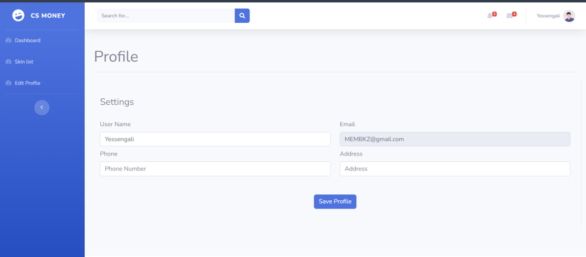
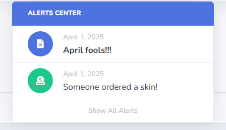
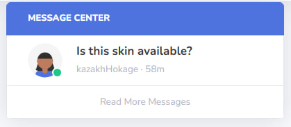
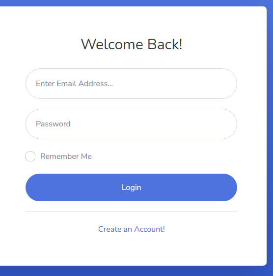
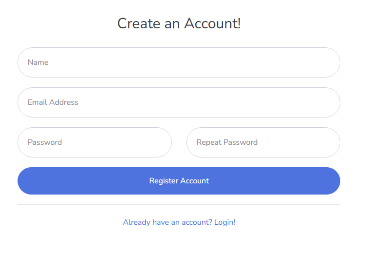

## 📌 Тестовое задание  

Разработан список предметов с backend-частью на Laravel и frontend на админ-панели.  

### 🔧 Функциональность:
- Добавление, удаление, редактирование, просмотр, поиск  
- Регистрация и авторизация  
- В списке предметов отображаются:  
  - Название предмета  
  - Описание  
  - Дата создания  
  - Дата редактирования  
- Внешний вид реализован с использованием Bootstrap  

### 🧪 Тестирование:
В коде добавлены два базовых теста:  
- Проверка загрузки главной страницы  
- Проверка запуска тестов  

### ⚠️ Заметки:
Не удалось реализовать корзину. Практический опыт работы с PHP ограничен университетскими знаниями, однако обладаю опытом в **Python, TypeScript, Vue.js, Git**. Готов изучать PHP в процессе выполнения задач!  

---  
## 🚀 Запуск проекта  

Следуйте этим шагам, чтобы развернуть проект локально:  

1. **Клонируйте репозиторий:**  
   ```bash
   git clone <ссылка на репозиторий>
   cd <имя_проекта>
   ```  

2. **Установите зависимости:**  
   ```bash
   composer install
   ```  

3. **Настройте базу данных:**  
   - Откройте файл `.env`  
   - Измените параметры подключения к базе данных  
   - Выполните миграции:  
     ```bash
     php artisan migrate
     ```  

4. **Запустите сервер:**  
   ```bash
   php artisan serve
   ```  

Теперь проект доступен по адресу: [http://127.0.0.1:8000](http://127.0.0.1:8000) 🚀  

## Скрины демо проекта







